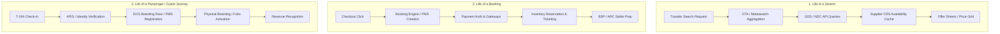

Reading additional input from stdin...
OpenAI Codex v0.140.0
--------
workdir: /home/ubuntu/workspace/travel-gaia
model: gpt-5.5
provider: openai
approval: never
sandbox: workspace-write [workdir, /tmp, $TMPDIR]
reasoning effort: medium
reasoning summaries: none
session id: 019f02ed-d296-7990-9e8f-ee19086e3788
--------
user
# Round 2 — cross-review & converge: "Life of …" flows

Two AIs (you + one other) independently answered the Round 1 brief for the Travel Wiki
"Life of …" journey flows. You now see the other's positions. **Converge to a single
buildable spec.** Be decisive on the contested points; don't hedge.

## Already agreed by BOTH (treat as settled — do not relitigate)
- New route `#/flows` (NOT a toggle inside the `#/classroom` Distribution Flow board).
- New `LIFE_FLOWS` data structure, separate from the existing `FLOWS` stage-board data.
- Primary graphic = **swimlane sequence diagram** (actor lanes as columns + directional
  message arrows: request solid, response thin/dashed, async dotted). Mobile = vertical
  step list/log preserving order, actor badges, terms, notes.
- Drop the label "Onboarding"; flow #3 = **Fulfillment** (traveler check-in→boarding/
  pickup/redemption→service→checkout). Supplier onboarding deferred.
- Universal flow concept, **vertical-specific steps/actors/vocabulary**.
- Bilingual (ko/en), hand-authored. Steps carry clickable glossary term ids → HTML step
  inspector. Reuse inlined d3. SVG for diagram, HTML for controls/inspector (don't fight
  SVG text wrapping). Field-manual aesthetic (hairlines, monochrome lanes, maroon accents).
- v1 leads with **Air + Lodging**; Payment and Change/Refund come later.

## Contested points — give your FINAL converged answer on each
**A. Flow set & how Payment / Change-Refund are handled.**
- Position 1 (codex): define 5 canonical flows (Search, Booking, **Payment & Settlement**,
  **Change/Disruption/Refund**, Fulfillment); ship Search/Booking/Fulfillment in v1, add
  Payment + Change/Refund as v1.1 *separate* flows.
- Position 2 (agy): only **3 flows**; fold payment INTO Booking as a step, and put
  disruption/refund as a narrative extension of post-booking — no separate flows.
- Decide: is the final model 3 flows or 5 flows (with 3 shipped first)? Are Payment and
  Change/Refund eventually their own swimlane flows, or folded into Booking/Fulfillment?

**B. v1 vertical scope.**
- codex: Air + Lodging + **Ground** (Ground = Booking + Fulfillment).
- agy: **Air + Lodging only**.
- Decide the exact v1 matrix (verticals × flows × approx step counts).

**C. Mobile rendering.**
- codex: render mobile as an HTML "message log" list from the same `steps[]` (not d3).
- agy: d3 reflows the swimlane into vertical timeline cards.
- Decide one (simplicity & robustness matter; it's an offline single file).

**D. Unified schema.** Reconcile the two schemas into ONE final `LIFE_FLOWS` shape.
- codex fields: `from,to,direction,action,message,terms[],note` (+optional
  `phase,emphasis,reversible,relatedFlowIds`); top-level `variants[vertical].{actors[],steps[]}`.
- agy fields: `fromActor,toActor,type,label,payloadLabel,terms[],desc`; top-level
  `verticals[vertical].{intro,steps[]}` with separate actor theming.
- Produce the single final schema (field names + structure) you both should build to.

## Output
A short, decisive converged spec: (A) final flow set + v1 list, (B) v1 vertical matrix,
(C) mobile choice, (D) the one final `LIFE_FLOWS` schema (as a code block), plus any
must-not-forget implementation note. This becomes the build spec.

## THE OTHER AI (agy) FULL ROUND-1 ANSWER:
# Design Brief: "Life of..." Journeys for Travel Wiki

This document outlines the proposed design and implementation specification for the new **"Life of..."** flow views in Travel Wiki. These views will provide dynamic, interactive sequence diagrams showing how travel artifacts (Search Queries, Bookings, Passengers) flow through industry systems and actors.

---

## 1. Flow Set: Defining the Canonical Journeys

We recommend launching with **three core transaction-centric flows** that trace the lifecycle of key travel artifacts. We integrate payment/settlement and disruption into these core journeys rather than building them as separate flows to avoid redundancy and keep the content anchored in high-value business contexts.



### Flow Definitions & Boundaries

1. **Life of a Search (The "Shopping" Phase)**
   - **Artifact**: Search Request (`Search Query` $\rightarrow$ `Offer Sheet / Price Grid`).
   - **Start State**: Traveler inputs parameters (origin, destination, dates) on a client interface (OTA/Metasearch).
   - **End State**: Aggregated, priced, and bookable offers are rendered to the traveler.
   - **Key Glossary Terms**: `ota`, `gds`, `ndc`, `metasearch`, `crs`, `cache`, `availability`.

2. **Life of a Booking (The "Transaction" Phase)**
   - **Artifact**: Passenger Name Record (`PNR`) / `Order` (NDC).
   - **Start State**: Traveler clicks "Book Now" and submits traveler details + credit card authorization.
   - **End State**: PNR is generated, ticketed/confirmed across suppliers, payment is cleared, and a Record Locator is delivered.
   - **Key Glossary Terms**: `pnr`, `record-locator`, `ticketing`, `bsp`, `arc`, `voiding`, `payment-gateway`.

3. **Life of a Passenger/Guest Journey (The "Fulfillment" Phase)**
   - **Artifact**: Boarding Pass / Check-in Manifest / Folio.
   - **Start State**: Check-in window opens (typically T-24 hours).
   - **End State**: Passenger boards the vehicle or enters the room (status changes to "Flown" or "In-House"), triggering revenue recognition.
   - **Key Glossary Terms**: `check-in`, `dcs`, `apis`, `boarding-pass`, `pms`, `revenue-recognition`, `no-show`.

---

## 2. "Onboarding" Disambiguation

> [!IMPORTANT]
> We recommend defining "Onboarding" exclusively as **Traveler/Guest Onboarding (Check-in $\rightarrow$ Security $\rightarrow$ Boarding/Embarkation)**. 

### Rationale
* **Glossary Alignment**: The Wiki glossary contains heavy operational terminology around traveler fulfillment (APIS, DCS, Boarding Pass, Manifest, Room Keys, PMS) that are visually exciting and sequence-driven.
* **Supplier Onboarding** (e.g., getting a boutique hotel listed on the GDS or integrating a new airline into an aggregator) is a long-running, manual, offline B2B project management process. It lacks the step-by-step transaction momentum that makes "Life of..." diagrams engaging.
* *Solution for Supplier Onboarding*: Document it as a static text explanation or a sidebar within the existing Distribution Flow page (`#/classroom`) rather than dedicating an interactive timeline to it.

---

## 3. Universality vs. Vertical-Specific

To scale across `air`, `lodging`, `ground`, `cruise`, and `tours`, we will use **Universal Flow Blueprints** with dynamic **Vertical Override Layers**.

* The sequence structural engine remains identical (e.g., Step 3 in a Booking flow is always "Inventory Reservation & Lock").
* The UI dynamically swaps terms, system names, and descriptions based on the selected vertical:

| Universal Step | Air Overrides | Lodging Overrides | Ground (Car Rental) Overrides |
| :--- | :--- | :--- | :--- |
| **Step 1: Intent** | Shopping Query | Availability Request | Rate Lookup |
| **Step 3: Core Write** | Create PNR in GDS/CRS | Create Reservation in CRS/PMS | Create Rental Agreement in FMS |
| **Step 5: Fulfillment** | Departure Control System (DCS) | Property Management System (PMS) | Counter Agent / Fleet System |
| **Step 6: Settlement** | BSP / ARC Clearinghouse | Guest Folio Invoice Settlement | Credit Card Pre-auth Settlement |

---

## 4. Graphic Form: The "Hybrid Sequence Swimlane"

To match the editorial "field manual" aesthetic (paper background, serif typography, high-contrast minimal rules) and maintain mobile responsiveness, we recommend a **D3-rendered Hybrid Sequence Swimlane** that reflows automatically.

### Desktop View (Horizontal Swimlanes)
* Actors form vertical columns.
* Steps flow top-to-bottom.
* Messages are represented by crisp, thin, directional lines with arrowheads (`stroke: #7a2520`).
* Clicking a line highlights the step, displays metadata in the sidebar, and highlights relevant glossary terms.

```
 TRAVELER          OTA / AGENT           GDS / HUB          SUPPLIER CRS
    │                   │                   │                   │
    ├─(1) Search Query─>│                   │                   │
    │                   ├──────(2) Lookup──>│                   │
    │                   │                   ├─────(3) Direct───>│
    │                   │                   │     Availability  │
    │                   │                   │<────(4) Inventory─┤
    │                   │<─────(5) Offers───┤                   │
    │<─(6) Price Grid───┤                   │                   │
    │                   │                   │                   │
```

### Mobile View (Vertical Flow Stepper)
On screens `< 768px`, the grid collapses into a vertical timeline card layout. Actor badges (e.g., `[Traveler]`, `[GDS]`) are printed inside each step card, avoiding horizontal overflow or unreadable text columns.

---

## 5. Data Model Schema (`LIFE_FLOWS`)

We propose the following bilingual, JSON-compatible format. This structure is human-editable and plugs directly into the existing build system.

```typescript
export interface LifeFlowStep {
  id: string;
  fromActor: string; // matches actors in CSS theme
  toActor: string;
  type: 'request' | 'response' | 'async';
  label: { en: string; ko: string };
  payloadLabel?: string; // e.g. "OTA_AirLowFareSearchRQ"
  terms: string[]; // ids matching glossary terms for clickable links
  desc: { en: string; ko: string };
  note?: { en: string; ko: string };
}

export interface VerticalFlow {
  intro: { en: string; ko: string };
  steps: LifeFlowStep[];
}

export interface LifeFlow {
  id: string;
  name: { en: string; ko: string };
  desc: { en: string; ko: string };
  verticals: {
    [verticalId: string]: VerticalFlow;
  };
}

export const LIFE_FLOWS: Record<string, LifeFlow> = {
  search: {
    id: "search",
    name: { en: "Life of a Search", ko: "검색의 일생" },
    desc: { en: "How a query goes from traveler to inventory.", ko: "여행객의 검색 요청이 인벤토리까지 도달하는 과정" },
    verticals: {
      air: {
        intro: { en: "Airline ticket search...", ko: "항공권 검색 과정..." },
        steps: [
          {
            id: "air_search_req",
            fromActor: "traveler",
            toActor: "ota",
            type: "request",
            label: { en: "1. Search Query", ko: "1. 검색 요청" },
            payloadLabel: "OTA_AirLowFareSearchRQ",
            terms: ["ota", "booking-engine"],
            desc: {
              en: "Traveler inputs dates and city pairs on OTA interface.",
              ko: "여행객이 OTA 인터페이스에 날짜와 출발/도착 도시를 입력합니다."
            }
          }
          // Additional steps...
        ]
      }
    }
  }
};
```

---

## 6. Placement & Navigation (Information Architecture)

We recommend creating a **new route `#/flows`** instead of overloading the existing `#/classroom` grid.

```
┌────────────────────────────────────────────────────────────────────────┐
│  Travel Wiki (Field Manual)                   [ Glossary ] [ Flows ]   │
├────────────────────────────────────────────────────────────────────────┤
│  Flow: [ Life of a Booking  v ]    Vertical: [ Air (Airline)     v ]   │
├────────────────────────────────────────────────────────────────────────┤
│                                                                        │
│   ( D3 Canvas: Hybrid Sequence Diagram with Maroon Accent Rules )      │
│                                                                        │
│   ┌─── Traveler ─────────── GDS / NDC ─────────── Airline CRS ──┐      │
│   │                                                             │      │
│   │   1. Click Book ───────────>                                │      │
│   │                             2. Create PNR ───────>          │      │
│   │                                                             │      │
│                                                                        │
├────────────────────────────────────────────────────────────────────────┤
│  Step Details (Sidebar or Bottom Drawer)                                │
│  "Step 2: Create PNR" (항공권 예약 정보 생성)                           │
│  Description: The GDS requests the Airline CRS to hold inventory and   │
│  issues a Passenger Name Record (PNR).                                 │
│  Related Terms: [GDS] [PNR] [Record Locator]                           │
└────────────────────────────────────────────────────────────────────────┘
```

### Rationale
* **UX Isolation**: The sequence diagram requires dedicated vertical height to look elegant. `#/classroom` already holds the static 7-stage distribution board, which should be kept separate to prevent scroll fatigue.
* **Bi-directional Linking**: Clicking a term in the sequence details pane opens the glossary sidebar. The glossary terms page will also display a section: *"This term is featured in: [Life of a Booking (Air) - Step 2]"*.

---

## 7. v1 Target Scope

We recommend prioritizing **Air** and **Lodging** verticals across **three primary flows**.

| Flow | Vertical | Steps | Key Actors Included |
| :--- | :--- | :---: | :--- |
| **Life of a Search** | **Air** | 6 | Traveler $\rightarrow$ OTA $\rightarrow$ GDS $\rightarrow$ Airline CRS $\rightarrow$ Aggregator $\rightarrow$ Traveler |
| **Life of a Search** | **Lodging** | 5 | Traveler $\rightarrow$ Metasearch $\rightarrow$ OTA $\rightarrow$ Channel Manager $\rightarrow$ CRS/PMS |
| **Life of a Booking** | **Air** | 7 | Traveler $\rightarrow$ OTA $\rightarrow$ GDS $\rightarrow$ CRS (inventory block) $\rightarrow$ Payment $\rightarrow$ BSP (ticketing) |
| **Life of a Booking** | **Lodging** | 6 | Traveler $\rightarrow$ OTA $\rightarrow$ Channel Manager $\rightarrow$ CRS $\rightarrow$ PMS (room lock) $\rightarrow$ Confirmation |
| **Life of a Passenger** | **Air** | 6 | Check-in $\rightarrow$ APIS verification $\rightarrow$ DCS (boarding pass) $\rightarrow$ Gate $\rightarrow$ Boarding |
| **Life of a Guest** | **Lodging** | 5 | Arrival $\rightarrow$ PMS Check-in $\rightarrow$ Folio Opening $\rightarrow$ Room Key Generation $\rightarrow$ In-House status |

---

## 8. Potential Pitfalls & Mitigations

1. **Text Label Wrapping in D3**: 
   * *Problem*: Korean translation text strings are frequently longer than their English counterparts, leading to layout overlaps.
   * *Mitigation*: Render text inside SVG `<foreignObject>` wrappers using flexbox/HTML text wrapping, or use clean, modern absolute-positioned HTML tooltips overlaid on the SVG coordinates.
2. **Offline Compile Size**:
   * *Problem*: D3.js can bloatedly expand files if not handled properly.
   * *Mitigation*: D3 is already inlined in the existing Travel Wiki bundle. We will reuse the preloaded D3 library to prevent any size footprint expansion.
3. **Complex Flow Loops**:
   * *Problem*: Sequence diagrams can become messy when depicting asynchronous API webhooks or error loops.
   * *Mitigation*: Limit sequence arrows to success paths (the "happy path"), and handle alternate/exceptional routes (such as credit card declines or overbooking) inside the Step Details narrative panel.
warning: Codex's Linux sandbox uses bubblewrap and needs access to create user namespaces.
codex
I’ll converge this as a build spec, treating the settled items as constraints and making firm calls on the four contested areas.
codex
**A. Flow Set**

Final model: **5 canonical flows**, with **3 shipped in v1**.

v1 ships:
- `search`
- `booking`
- `fulfillment`

v1.1 adds separate swimlane flows:
- `payment_settlement`
- `change_refund`

Payment appears in v1 Booking only as a necessary step, not the full lifecycle. Change/refund appears only as a brief related-flow note where relevant. Both eventually become their own swimlane flows because their actors, timing, reversals, exceptions, and terminology are materially different from simple booking/fulfillment happy paths.

**B. v1 Vertical Matrix**

v1 scope: **Air + Lodging only**.

| Flow | Air | Lodging |
|---|---:|---:|
| Search | 6 steps | 5 steps |
| Booking | 7 steps, includes payment authorization/ticketing handoff | 6 steps, includes payment guarantee/deposit/confirmation |
| Fulfillment | 6 steps | 5 steps |

Ground is deferred. It is valuable, but v1 should prove the interaction model and bilingual content quality with the two highest-priority verticals first.

**C. Mobile Rendering**

Use **HTML message log from the same `steps[]`**, not d3 reflow.

Mobile should render a vertical ordered list with:
- step number
- actor badges
- arrow/type indicator
- bilingual action/message
- clickable glossary terms
- note/inspector affordance

This is simpler, more robust offline, easier to make accessible, and avoids SVG text/layout problems on small screens.

**D. Final `LIFE_FLOWS` Schema**

```ts
type LocaleText = {
  en: string;
  ko: string;
};

type LifeFlowMessageType = "request" | "response" | "async";

type LifeFlowActor = {
  id: string;
  name: LocaleText;
  shortName?: LocaleText;
  role?: LocaleText;
};

type LifeFlowStep = {
  id: string;
  from: string;              // actor id
  to: string;                // actor id
  type: LifeFlowMessageType; // request=solid, response=thin/dashed, async=dotted

  action: LocaleText;        // short visible arrow/list label
  message?: LocaleText;      // payload/business object, e.g. "PNR create request"
  description: LocaleText;   // inspector body copy

  terms: string[];           // glossary term ids
  note?: LocaleText;         // inspector note, optional

  phase?: string;            // optional grouping label, e.g. "offer", "confirm"
  emphasis?: "normal" | "key" | "risk";
  relatedFlowIds?: string[]; // e.g. ["payment_settlement"], ["change_refund"]
};

type LifeFlowVariant = {
  intro: LocaleText;
  actors: LifeFlowActor[];
  steps: LifeFlowStep[];
};

type LifeFlow = {
  id: string;
  name: LocaleText;
  shortName?: LocaleText;
  description: LocaleText;
  artifact: LocaleText;
  status: "v1" | "v1_1" | "deferred";

  variants: {
    air?: LifeFlowVariant;
    lodging?: LifeFlowVariant;
    ground?: LifeFlowVariant;
    cruise?: LifeFlowVariant;
    tours?: LifeFlowVariant;
  };
};

export const LIFE_FLOWS: Record<string, LifeFlow> = {
  search: {
    id: "search",
    name: { en: "Life of a Search", ko: "검색의 일생" },
    description: {
      en: "How intent becomes priced, bookable offers.",
      ko: "여행 의도가 가격이 붙은 예약 가능 오퍼가 되는 과정입니다."
    },
    artifact: { en: "Search query / offer set", ko: "검색 요청 / 오퍼 묶음" },
    status: "v1",
    variants: {
      air: {
        intro: { en: "...", ko: "..." },
        actors: [],
        steps: []
      },
      lodging: {
        intro: { en: "...", ko: "..." },
        actors: [],
        steps: []
      }
    }
  }
};
```

**Must-Not-Forget Implementation Notes**

- Route is `#/flows`.
- Desktop uses d3 only for SVG swimlane geometry/arrows.
- Mobile uses HTML generated from the same `steps[]`.
- Step inspector is HTML, not SVG.
- Do not label Fulfillment as Onboarding.
- Keep payment/change-refund represented in v1 as references only; build them as separate v1.1 flow records, not hidden branches inside Booking.
tokens used
7,215
**A. Flow Set**

Final model: **5 canonical flows**, with **3 shipped in v1**.

v1 ships:
- `search`
- `booking`
- `fulfillment`

v1.1 adds separate swimlane flows:
- `payment_settlement`
- `change_refund`

Payment appears in v1 Booking only as a necessary step, not the full lifecycle. Change/refund appears only as a brief related-flow note where relevant. Both eventually become their own swimlane flows because their actors, timing, reversals, exceptions, and terminology are materially different from simple booking/fulfillment happy paths.

**B. v1 Vertical Matrix**

v1 scope: **Air + Lodging only**.

| Flow | Air | Lodging |
|---|---:|---:|
| Search | 6 steps | 5 steps |
| Booking | 7 steps, includes payment authorization/ticketing handoff | 6 steps, includes payment guarantee/deposit/confirmation |
| Fulfillment | 6 steps | 5 steps |

Ground is deferred. It is valuable, but v1 should prove the interaction model and bilingual content quality with the two highest-priority verticals first.

**C. Mobile Rendering**

Use **HTML message log from the same `steps[]`**, not d3 reflow.

Mobile should render a vertical ordered list with:
- step number
- actor badges
- arrow/type indicator
- bilingual action/message
- clickable glossary terms
- note/inspector affordance

This is simpler, more robust offline, easier to make accessible, and avoids SVG text/layout problems on small screens.

**D. Final `LIFE_FLOWS` Schema**

```ts
type LocaleText = {
  en: string;
  ko: string;
};

type LifeFlowMessageType = "request" | "response" | "async";

type LifeFlowActor = {
  id: string;
  name: LocaleText;
  shortName?: LocaleText;
  role?: LocaleText;
};

type LifeFlowStep = {
  id: string;
  from: string;              // actor id
  to: string;                // actor id
  type: LifeFlowMessageType; // request=solid, response=thin/dashed, async=dotted

  action: LocaleText;        // short visible arrow/list label
  message?: LocaleText;      // payload/business object, e.g. "PNR create request"
  description: LocaleText;   // inspector body copy

  terms: string[];           // glossary term ids
  note?: LocaleText;         // inspector note, optional

  phase?: string;            // optional grouping label, e.g. "offer", "confirm"
  emphasis?: "normal" | "key" | "risk";
  relatedFlowIds?: string[]; // e.g. ["payment_settlement"], ["change_refund"]
};

type LifeFlowVariant = {
  intro: LocaleText;
  actors: LifeFlowActor[];
  steps: LifeFlowStep[];
};

type LifeFlow = {
  id: string;
  name: LocaleText;
  shortName?: LocaleText;
  description: LocaleText;
  artifact: LocaleText;
  status: "v1" | "v1_1" | "deferred";

  variants: {
    air?: LifeFlowVariant;
    lodging?: LifeFlowVariant;
    ground?: LifeFlowVariant;
    cruise?: LifeFlowVariant;
    tours?: LifeFlowVariant;
  };
};

export const LIFE_FLOWS: Record<string, LifeFlow> = {
  search: {
    id: "search",
    name: { en: "Life of a Search", ko: "검색의 일생" },
    description: {
      en: "How intent becomes priced, bookable offers.",
      ko: "여행 의도가 가격이 붙은 예약 가능 오퍼가 되는 과정입니다."
    },
    artifact: { en: "Search query / offer set", ko: "검색 요청 / 오퍼 묶음" },
    status: "v1",
    variants: {
      air: {
        intro: { en: "...", ko: "..." },
        actors: [],
        steps: []
      },
      lodging: {
        intro: { en: "...", ko: "..." },
        actors: [],
        steps: []
      }
    }
  }
};
```

**Must-Not-Forget Implementation Notes**

- Route is `#/flows`.
- Desktop uses d3 only for SVG swimlane geometry/arrows.
- Mobile uses HTML generated from the same `steps[]`.
- Step inspector is HTML, not SVG.
- Do not label Fulfillment as Onboarding.
- Keep payment/change-refund represented in v1 as references only; build them as separate v1.1 flow records, not hidden branches inside Booking.
